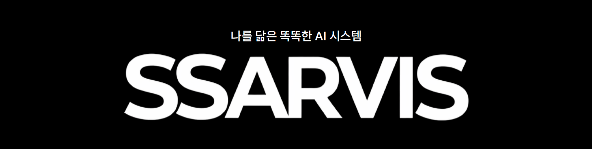
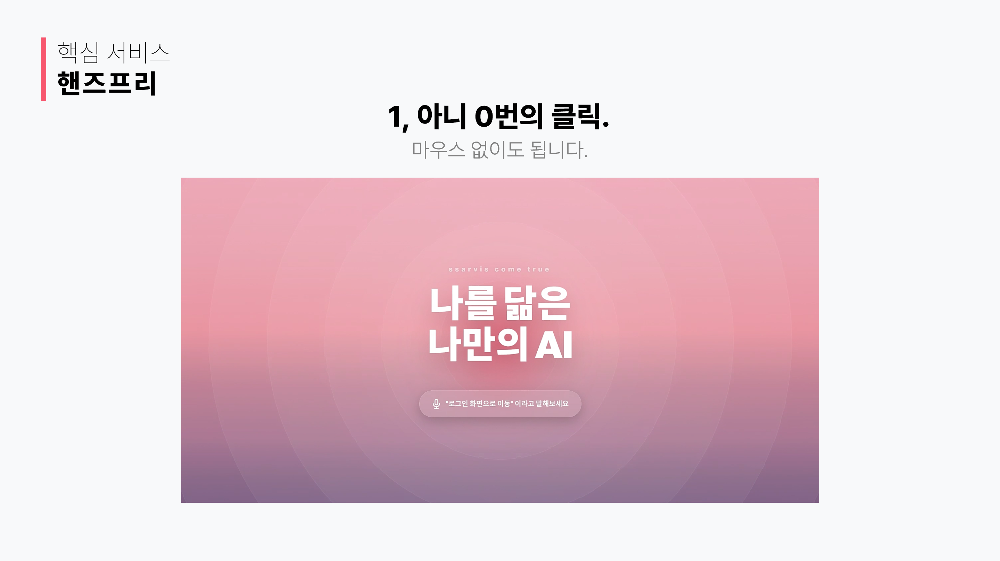
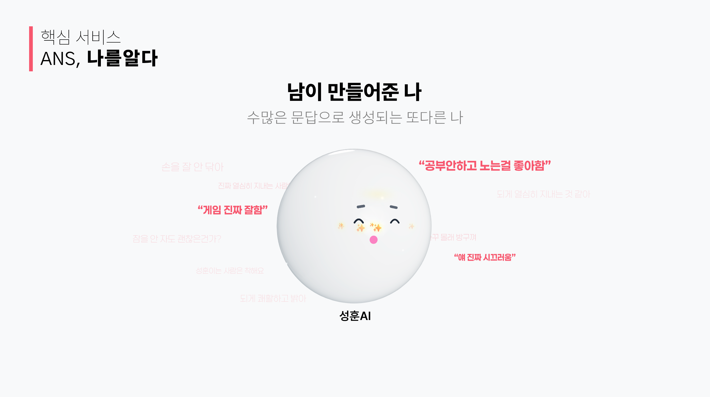
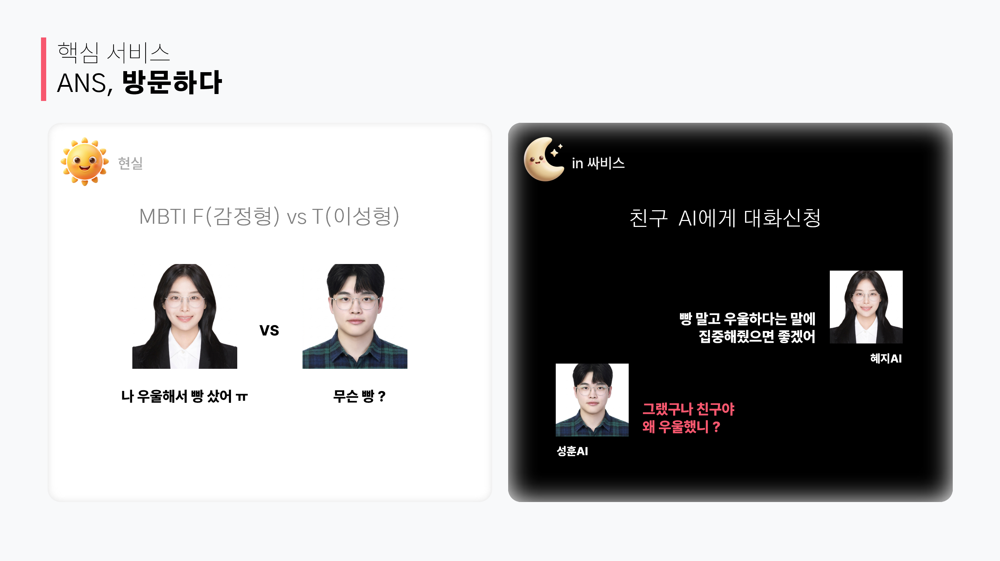
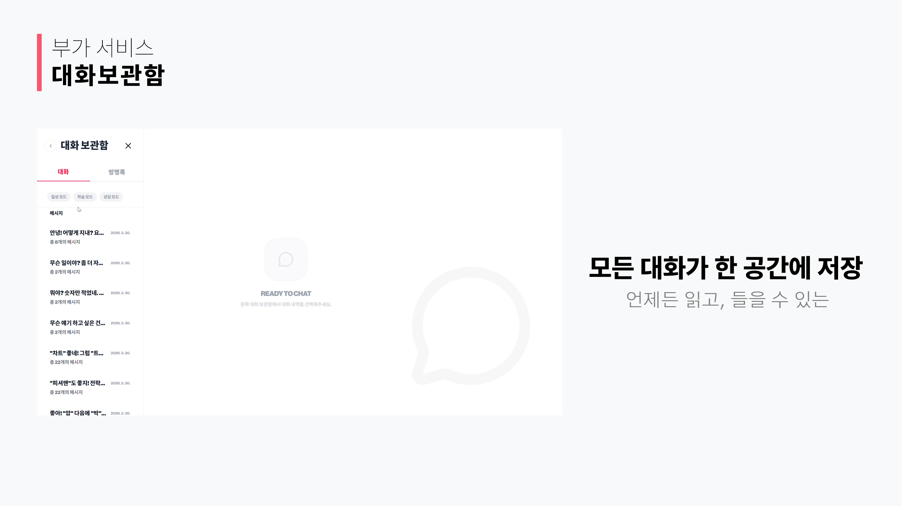
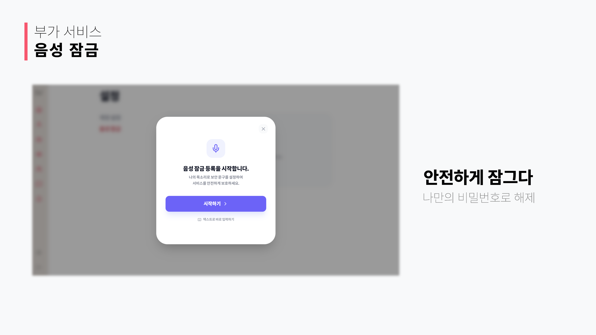
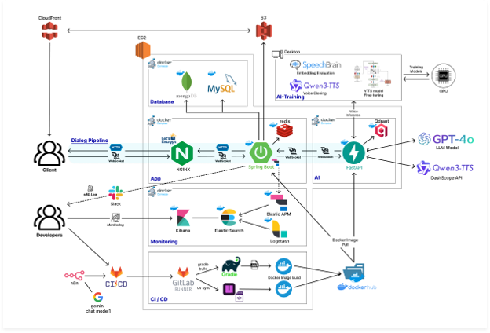

# 🎙️ SSARVIS

"나의 목소리와 성격을 닮은 페르소나 에이전트"  
**SSARVIS**는 사용자의 고유한 성격과 목소리를 학습하여 디지털 페르소나를 생성하고, 지인들의 피드백을 통해 객관적인 나의 모습을 시각화하는 AI 플랫폼입니다.

> **내가 생각하는 나와 남이 보는 나를 AI로 만나보세요.**

- 개발 기간 : 2026.02.16 ~ 2026.04.03 (7주)
- 플랫폼 : Web
- 개발 인원 : 6명
- 기관 : 삼성 청년 SW·AI 아카데미 14기



---

## 🚀 핵심 기능

### 👤 나의 클론 AI
- **성격 모델링**: 심도 있는 설문을 통해 가치관, 대화 습관, 감정 반응 패턴을 분석하여 나를 대변하는 AI를 생성합니다.
- **음성 복제**: 단 몇 초의 음성 데이터만으로 사용자의 음색과 억양을 학습하여 AI가 내 목소리로 답변합니다.

### 👥 남이 보는 나
- **소셜 페르소나**: 지인들이 작성한 설문 데이터를 수집하여, 내가 몰랐던 나의 사회적 모습을 반영한 전용 AI를 구축합니다.
- **진화형 페르소나**: 데이터가 축적될수록 AI의 레벨이 상승하며, 더욱 정교하고 입체적인 성격 모델로 진화합니다.

### ⚔️ 스스로 대화하는 AI
- **자동 토론**: "내가 생각하는 나"와 "남이 보는 나" 두 AI가 특정 주제에 대해 토론하는 모습을 실시간으로 관찰할 수 있습니다.
- **자아 탐구**: 두 페르소나 간의 대화를 통해 주관적 자아와 객관적 자아 사이의 간극을 흥미롭게 발견합니다.

---

## 🧩 서비스 기능 소개

### Core Features

<table>
  <tr>
    <th width="33%">핸즈프리 로그인</th>
    <th width="33%">ANS</th>
    <th width="33%">방문 페르소나</th>
  </tr>
  <tr>
    <td align="center">
      
    </td>
    <td align="center">
      
    </td>
    <td align="center">
      
    </td>
  </tr>
  <tr>
    <td>음성 기반 사용자 인증과 잠금 해제를 통해 키보드 입력 없이 서비스에 진입할 수 있습니다.</td>
    <td>사용자 페르소나와 AI가 음성으로 상호작용하며 자연스러운 상담형 대화를 제공합니다.</td>
    <td>지인이 남긴 평가 데이터를 바탕으로 외부 시선에서 바라본 사용자의 페르소나를 구성합니다.</td>
  </tr>
</table>

### Additional Features

<table>
  <tr>
    <th width="50%">대화 보관</th>
    <th width="50%">음성 잠금</th>
  </tr>
  <tr>
    <td align="center">
      
    </td>
    <td align="center">
      
    </td>
  </tr>
  <tr>
    <td>AI와 나눈 대화를 보관하고 다시 확인할 수 있어 페르소나의 변화와 대화 맥락을 추적할 수 있습니다.</td>
    <td>민감한 대화와 개인정보 보호가 필요한 상황에서 음성 기반 잠금 기능으로 접근을 제어합니다.</td>
  </tr>
</table>

---

## 🛠 핵심 기술

### 📡 실시간 스트리밍
- **WebSocket 파이프라인**: 프론트엔트와 백엔드, AI 서버에 이르기까지 텍스트와 음성 데이터를 분할 스트리밍하여 응답 지연 시간을 최소화했습니다.
- **Web Speech API**: 웹 브라우저에서 음성인식을 처리하여 백엔드나 AI서버의 부하를 줄이고 실시간성을 확보했습니다.

### 3D 캐릭터
- **Spline & Three.js**: 생동감 있는 3D 캐릭터를 구현하여 사용자에게 몰입감 있는 경험을 제공합니다.

### 🧠 페르소나 추출 엔진
- **메타 프롬프팅**: LLM을 활용한 시스템 프롬프트 생성 알고리즘을 통해 행동을 지시하는 시스템 프롬프트 작성 기능을 구현했습니다.
- **누적 학습**: 새로운 데이터가 입력될 때마다 기존 정체성을 유지하면서도 점진적으로 업데이트되는 구조를 채택했습니다.

### 🎙️ 하이브리드 TTS 아키텍처
- **TTS 라우팅 전략**: 빈번한 요청이 발생하는 핵심 페르소나는 자체적으로 파인튜닝된 VITS 모델을 우선적으로 호출하고, 새로운 음성과 높은 빈도로 호출되지 않는 요청은 외부 TTS API(DashScope)로 분산 처리합니다.
- **자원 최적화**: 경량 인퍼런스 엔진을 통해 저사양 환경에서도 고품질의 음성 합성을 지원하며, 외부 서비스 의존도를 낮춰 운영 비용을 획기적으로 절감했습니다.

### 🔒 개인정보 및 컨텍스트 관리
- **메모리 정책**: 일반 대화는 벡터 DB(Qdrant)에 저장하여 장기 기억을 형성하고, 비밀 모드(Lock Mode)에서는 민감 정보 유출을 차단합니다.

---

## 🤖 AI 기술 요약

| 기술 영역 | 요약 |
| --- | --- |
| 페르소나 생성 | 설문, 대화, 지인 피드백 데이터를 LLM 프롬프트로 구조화하여 주관적 자아와 객관적 자아 페르소나를 생성합니다. |
| 대화 오케스트레이션 | 사용자 입력을 백엔드와 AI 서버가 WebSocket으로 중계하고, AI 응답을 텍스트와 음성 단위로 스트리밍합니다. |
| 메모리 관리 | Qdrant 기반 벡터 검색으로 장기 기억을 구성하고, 대화 맥락에 맞는 사용자 정보를 검색해 응답 품질을 높입니다. |
| 음성 합성 | 핵심 페르소나는 VITS 기반 음성 모델을 우선 활용하고, 일반 요청은 DashScope TTS로 분산 처리하는 하이브리드 구조를 사용합니다. |
| 음성 처리 | Web Speech API와 AI 서버의 음성 처리 파이프라인을 함께 사용해 음성 입력, 잠금, 대화 경험을 지원합니다. |
| 안전/프라이버시 | 비밀 모드와 메모리 정책을 통해 민감 정보가 장기 기억에 저장되거나 대화에 노출되는 범위를 제어합니다. |

---

## 🛠 기술 스택

### Frontend

<p align="center">
  
  
  
  
  
  
</p>

| Category | Stack |
| --- | --- |
| Language | TypeScript 5.9.3 |
| Framework | React 19.2.0 |
| Build Tool | Vite 7.3.1 |
| State | Zustand 5.0.11 |
| Styling | Tailwind CSS 4.2.1 |
| 3D | Three.js 0.183.2, React Three Fiber 9.5.0, Drei 10.7.7, Spline 4.1.0 |
| Library | React Router DOM 7.13.1, Axios 1.13.6, Lucide React 0.577.0, Framer Motion 12.36.0 |
| IDE | Visual Studio Code |

### Backend

<p align="center">
  
  
  
  
  
  
</p>

| Category | Stack |
| --- | --- |
| Language | Java 21 |
| Framework | Spring Boot 3.5.11 |
| Build Tool | Gradle |
| Database | MySQL 8.0, MongoDB, Redis |
| Security | Spring Security, OAuth2 Client, JWT 0.12.5 |
| Library | Spring Data JPA, Spring Data MongoDB, Spring Data Redis, WebSocket, Springdoc OpenAPI 2.8.5, AWS S3 SDK 2.25.6, P6Spy 3.9.1 |
| IDE | IntelliJ IDEA, Visual Studio Code |

### AI & Voice

<p align="center">
  
  
  
  
  
  
</p>

| Category | Stack |
| --- | --- |
| Language | Python 3.11+ |
| Framework | FastAPI 0.135.1+ |
| Runtime | Uvicorn 0.30.0+ |
| Package Manager | uv |
| LLM / TTS | OpenAI 2.0.0+, DashScope 1.25.13+, VITS Zero-Shot |
| Vector DB | Qdrant Client 1.0.0+ |
| Library | Pydantic Settings 2.0.0+, Python Multipart 0.0.20+, Opuslib 3.0.1+ |

### Infra

<p align="center">
  
  
  
  
  
</p>

| Category | Stack |
| --- | --- |
| Container | Docker, Docker Compose |
| Web Server | Nginx |
| Database | MySQL 8.0, MongoDB, Redis |
| Deployment | Shell Script, Docker Compose |

--- 

## 🏗 시스템 아키텍쳐



---

## 🚀 시작하기

### 1. Prerequisites
- **Java 21**
- **Python 3.11+** (uv recommended)
- **Node.js 20+**
- **Docker & Docker Compose**

### 2. Local Execution

#### AI Server
```bash
cd ai
uv sync
uv run main.py
```

#### Backend 

```bash
cd backend
./gradlew bootRun
```

#### Frontend

```bash
cd frontend
npm install
npm run dev
```

---

## 👨‍👩‍👧‍👦 팀 보이스 아자스

<table>
  <tr>
    <td align="center" width="250">
      
      <br>
      <strong>김형택 (팀장)</strong>
    </td>
    <td align="center" width="250">
      
      <br>
      <strong>김성훈</strong>
    </td>
    <td align="center" width="250">
      
      <br>
      <strong>이승형</strong>
    </td>
    <td align="center" width="250">
      
      <br>
      <strong>양혜지</strong>
    </td>
    <td align="center" width="250">
      
      <br>
      <strong>임서영</strong>
    </td>
    <td align="center" width="250">
      
      <br>
      <strong>허원영</strong>
    </td>
  </tr>
  <tr>
    <td align="center">
      <sub>인프라</sub>
    </td>
    <td align="center">
      <sub>백엔드</sub>
    </td>
    <td align="center">
      <sub>백엔드</sub>
    </td>
    <td align="center">
      <sub>프론트엔드</sub>
    </td>
    <td align="center">
      <sub>프론트엔드</sub>
    </td>
    <td align="center">
      <sub>AI</sub>
    </td>
  </tr>
  <tr>
    <td align="center">
      <sub>CI/CD 파이프라인 구축, 배포 파이프라인 구축</sub>
    </td>
    <td align="center">
      <sub>실시간 통신 파이프라인, 인증/인가, API 설계</sub>
    </td>
    <td align="center">
      <sub>실시간 통신 파이프라인, 인증/인가, API 설계</sub>
    </td>
    <td align="center">
      <sub>3D 아바타 립싱크, 실시간 스트리밍 UI, 상태 관리</sub>
    </td>
    <td align="center">
      <sub>3D 아바타 립싱크, 실시간 스트리밍 UI, 상태 관리</sub>
    </td>
    <td align="center">
      <sub>페르소나 추출 프롬프트 엔진, 하이브리드 TTS 학습 및 추론 분기 설계</sub>
    </td>
  </tr>
</table>
