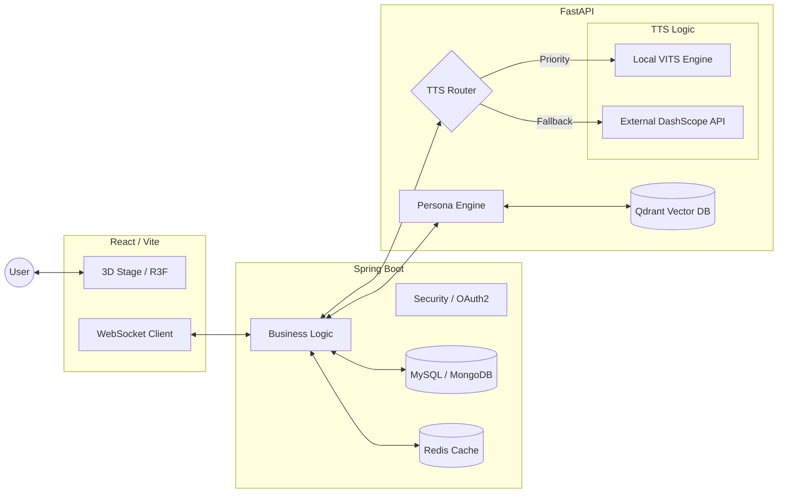

#  SSARVIS (싸비스)

> **"나의 목소리와 성격을 닮은 AI, 그리고 타인의 시선이 투영된 AI가 공존하며 대화하는 3D 페르소나 에이전트"**

SSARVIS(Ssafy + Jarvis)는 단순한 챗봇을 넘어, 사용자의 고유한 성격과 목소리를 학습하여 디지털로 복제하고, 지인들의 피드백을 통해 객관적인 '페르소나'를 시각화하는 초개인화 AI 플랫폼입니다.

---

## 🚀 Key Features

### 👤 My Assistant (나를 닮은 AI)
- **성격 모델링**: 심도 있는 설문을 통해 가치관, 대화 습관, 감정 반응 패턴을 분석하여 나를 대변하는 AI를 생성합니다.
- **음성 복제 (Voice Cloning)**: 단 몇 초의 음성 데이터만으로 사용자의 음색과 억양을 학습하여 AI가 내 목소리로 답변합니다.

### 👥 Namna AI (남이 보는 나)
- **소셜 페르소나**: 지인들이 작성한 설문 데이터를 수집하여, 내가 몰랐던 나의 사회적 모습을 반영한 전용 AI를 구축합니다.
- **진화형 페르소나**: 데이터가 축적될수록 AI의 레벨이 상승하며, 더욱 정교하고 입체적인 성격 모델로 진화합니다.

### ⚔️ Dual AI Battle (AI-to-AI Chat)
- **자동 토론**: "내가 생각하는 나"와 "남이 보는 나" 두 AI가 특정 주제에 대해 토론하는 모습을 실시간으로 관찰할 수 있습니다.
- **자아 탐구**: 두 페르소나 간의 대화를 통해 주관적 자아와 객관적 자아 사이의 간극을 흥미롭게 발견합니다.

### 🎨 3D Interactive Stage
- **실시간 립싱크**: AI의 음성 출력에 맞춰 3D 아바타의 입 모양이 실시간으로 조절됩니다.
- **동적 애니메이션**: 대화 맥락과 감정에 따라 아바타의 표정과 몸짓이 변화하여 생동감 넘치는 대화 경험을 제공합니다.

---

## 🛠 Technical Highlights

### 🧠 Persona Extraction Engine
- **Meta-Prompting**: LLM을 활용한 시스템 프롬프트 생성 알고리즘을 통해 행동을 지시하는 시스템 프롬프트 작성 기능을 구현했습니다.
- **Real-time Refining**: 새로운 데이터가 입력될 때마다 기존 정체성을 유지하면서도 점진적으로 업데이트되는 구조를 채택했습니다.

### 🎙️ Hybrid TTS Architecture
- **TTS Routing Strategy**: 빈번한 요청이 발생하는 핵심 페르소나는 **자체적으로 파인튜닝된 VITS 모델**을 우선적으로 호출하고, 새로운 음성과 높은 빈도로 호출되지 않는 요청은 외부 TTS API(DashScope)로 분산 처리합니다.
- **Resource Optimization**: 경량 인퍼런스 엔진을 통해 저사양 환경에서도 고품질의 음성 합성을 지원하며, 외부 서비스 의존도를 낮춰 운영 비용을 획기적으로 절감했습니다.

### 📡 Multi-modal Streaming
- **WebSocket Pipeline**: 텍스트와 음성 데이터를 분할 스트리밍하여 응답 지연 시간을 최소화했습니다.
- **On-device Rendering**: Spline과 Three.js를 활용하여 웹 브라우저 환경에서도 끊김 없는 3D 퍼포먼스를 보장합니다.

### 🔒 Privacy & Context Management
- **Memory Policy**: 일반 대화는 벡터 DB(Qdrant)에 저장하여 장기 기억을 형성하고, 비밀 모드(Lock Mode)에서는 민감 정보 유출을 차단합니다.

---

## 🛠 Tech Stack

### AI & Voice


### Backend


### Frontend


---

## 🏗 System Architecture



---

## 🚀 Getting Started

### 1. Prerequisites
- **Java 21**
- **Python 3.12+** (uv recommended)
- **Node.js 20+**
- **Docker & Docker Compose**

### 2. Local Execution

#### AI Server
```bash
cd ai
uv sync
uv run main.py
```

#### Backend / Frontend
각 디렉토리에서 관련 패키지를 설치한 후 개발 서버를 실행하십시오.

---

## 👨‍👩‍👧‍👦 Team SSARVIS

<table>
  <tr>
    <td align="center" width="250">
      
      <br>
      <strong>팀원 1</strong>
      <br>
      (Frontend)
    </td>
    <td align="center" width="250">
      
      <br>
      <strong>팀원 2</strong>
      <br>
      (Backend)
    </td>
    <td align="center" width="250">
      
      <br>
      <strong>팀원 3</strong>
      <br>
      (AI)
    </td>
    <td align="center" width="250">
      
      <br>
      <strong>팀원 4</strong>
      <br>
      (DevOps)
    </td>
  </tr>
  <tr>
    <td align="center">
      <sub>3D 아바타 립싱크, 실시간 스트리밍 UI, 상태 관리</sub>
    </td>
    <td align="center">
      <sub>실시간 통신 파이프라인, 인증/인가, API 설계</sub>
    </td>
    <td align="center">
      <sub>페르소나 추출 프롬프트 엔진, 하이브리드 TTS 분기 설계</sub>
    </td>
    <td align="center">
      <sub>CI/CD 파이프라인 구축, 온디바이스 인퍼런스 최적화</sub>
    </td>
  </tr>
</table>

---

© 2026 Team SSARVIS. All Rights Reserved.